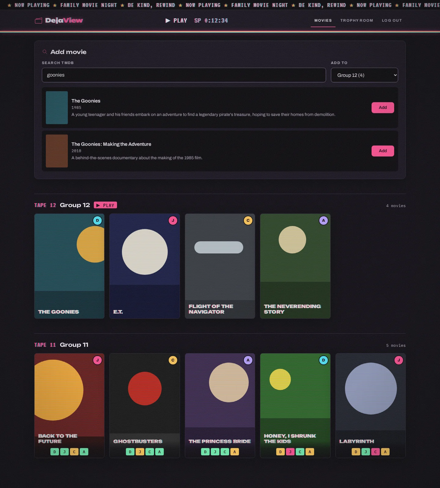
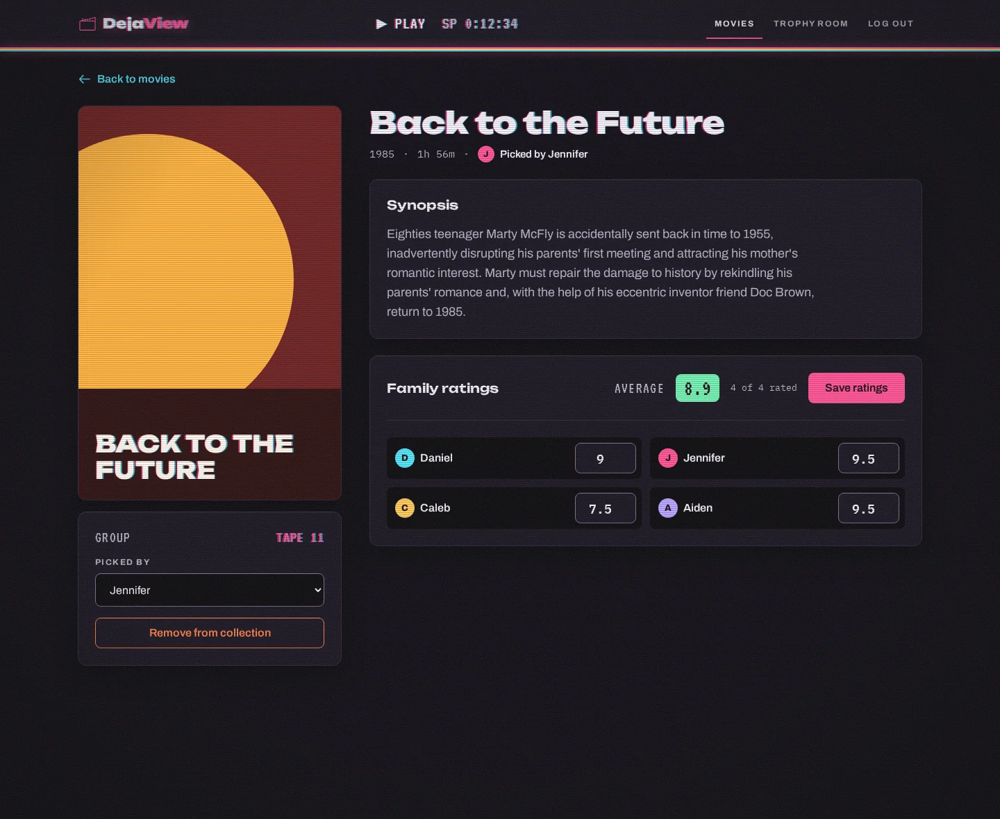
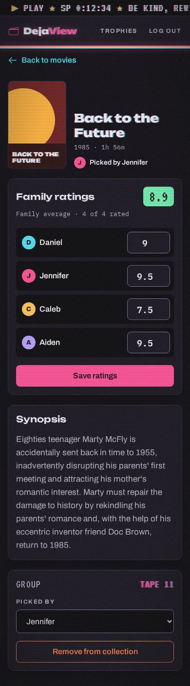
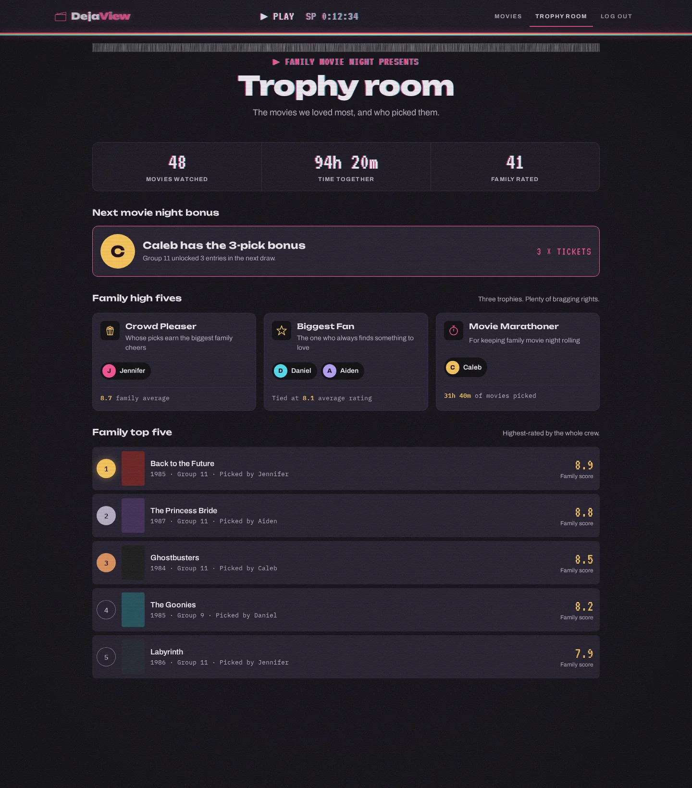
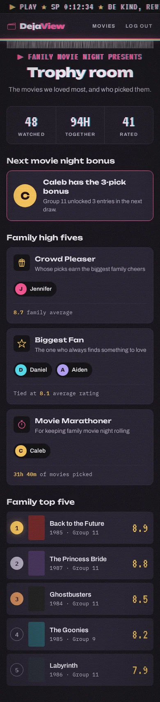
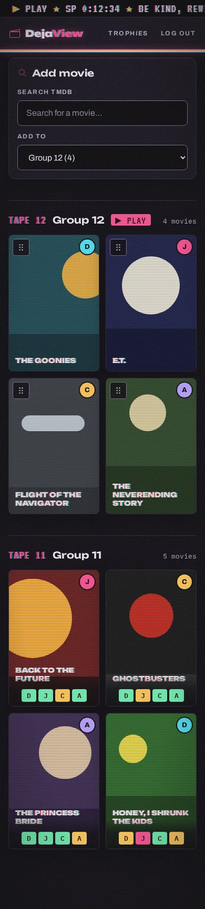
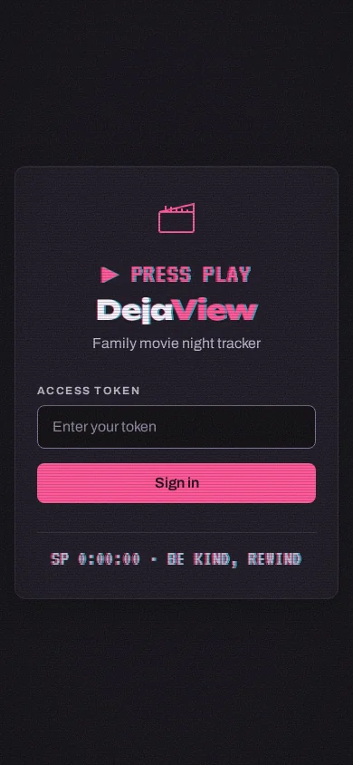

# Late Show: the DejaView design system

The redesign of DejaView's look: a rented tape playing on a CRT at midnight. Scanlines, a soft vignette, film grain, red-and-cyan misregistration on big type, and the VCR's own on-screen display (▶ PLAY, the tape counter) around a clean, readable app. It replaces the Retro VHS Night styles in `tailwind/styles.css`.

## What's here

| File | What it is |
| --- | --- |
| [`brand-book.md`](brand-book.md) | Principles, voice, color, type, texture (the tape layer), states, icons and layout rules. Start here. |
| [`tokens.json`](tokens.json) | Every token with a usage note: colors, type styles, spacing, radii, shadows, texture opacities. |
| [`tokens.css`](tokens.css) | The same tokens as CSS custom properties and type-style classes, generated from `tokens.json`. |
| [`components.css`](components.css) | The component layer. Class names match the Templ markup in `internal/ui`, so it can replace the `@layer components` block in `tailwind/styles.css`. The tape layer is at the end. |
| [`components.md`](components.md) | Guidelines for each of the 16 components. |
| [`migration.md`](migration.md) | Old variable → new token map, contrast fixes, and the markup changes the redesign needs. |
| [`mockups/`](mockups) | Rendered mockups of the dashboard, movie detail, trophy room and sign-in screens at desktop and phone size. |
| `mockups/source/` | The mockup sources (`.dc.html`). They render in the Claude design canvas, not on their own; the images above are the reference. |

## Mockups

| Desktop | Phone |
| --- | --- |
|  |  |
|  |  |
| |   |

Poster art in the mockups is placeholder shapes; the real TMDB posters fill the same 2:3 frames. Scores, totals and the bonus holder are sample data; the trophy names and descriptions are the real ones from `internal/handler/stats.go`.

## Tape wear

All the texture is set by one class on `<body>`: `tape-clean`, `tape-worn` (the default) or `tape-rewound`. See the Texture section of the brand book for what each level changes.
