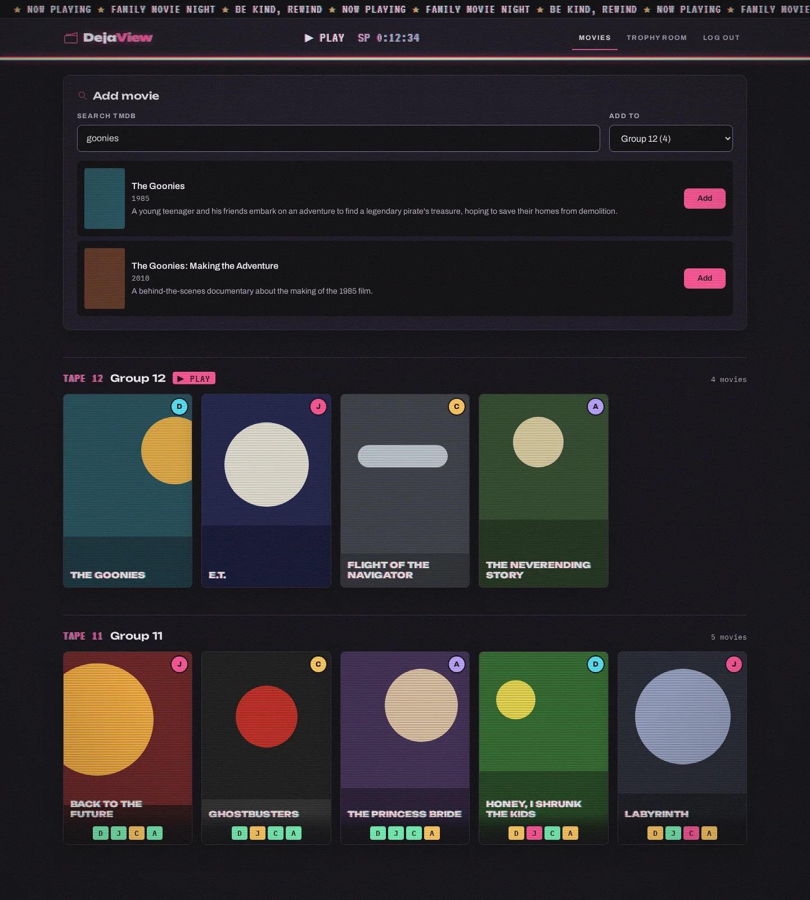
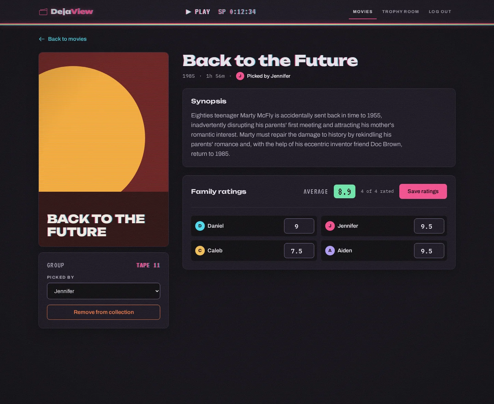
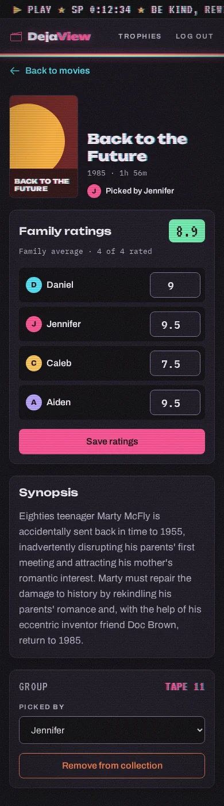
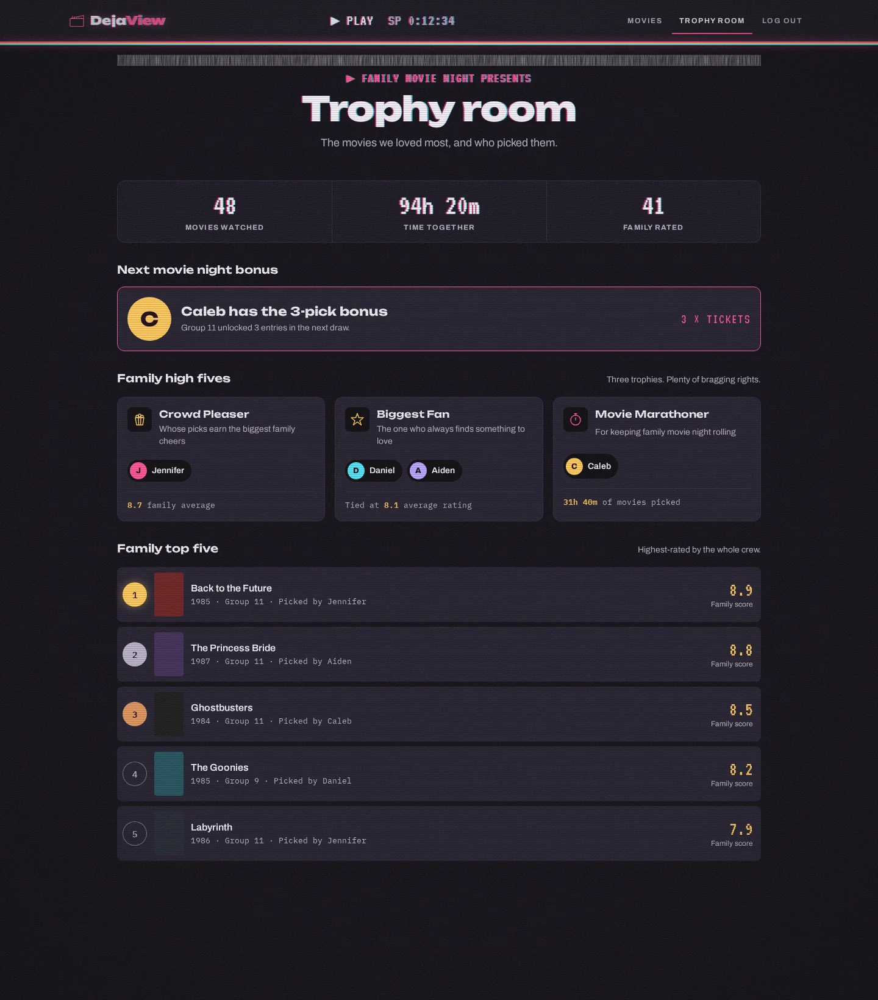
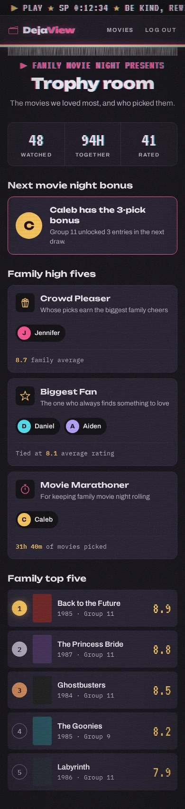
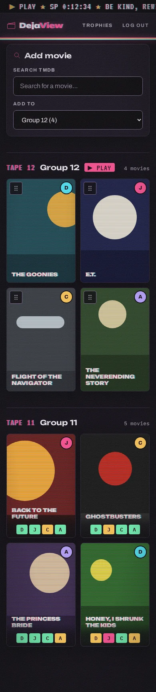
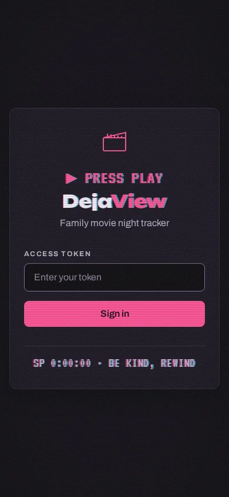

# Late Show: the DejaView design system

The redesign of DejaView's look: a rented tape playing on a CRT at midnight. Scanlines, a soft vignette, film grain, red-and-cyan misregistration on big type, and the VCR's own on-screen display (▶ PLAY, the tape counter) around a clean, readable app. The tokens and component layer are implemented in `tailwind/styles.css`.

## What's here

| File | What it is |
| --- | --- |
| [`brand-book.md`](brand-book.md) | Principles, voice, color, type, texture (the tape layer), states, icons and layout rules. Start here. |
| [`tokens.json`](tokens.json) | Every token with a usage note: colors, type styles, spacing, radii, shadows, texture opacities. |
| [`components.md`](components.md) | Guidelines for each of the 16 components. |
| [`mockups/`](mockups) | Rendered mockups of the dashboard, movie detail, trophy room and sign-in screens at desktop and phone size. |

## Mockups

| Desktop | Phone |
| --- | --- |
|  |  |
|  |  |
| |   |

Poster art in the mockups is placeholder shapes; the real TMDB posters fill the same 2:3 frames. Scores, totals and the bonus holder are sample data; the trophy names and descriptions are the real ones from `internal/handler/stats.go`.

## Tape wear

All the texture is set by one class on `<body>`: `tape-clean`, `tape-worn` (the default) or `tape-rewound`. See the Texture section of the brand book for what each level changes.
